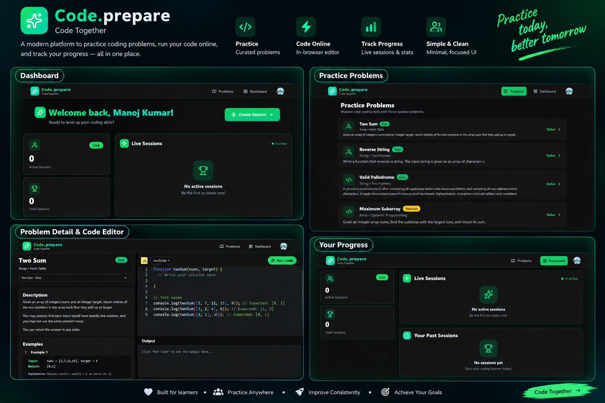

<div align="center">

# Code.prepare

### A modern coding practice and collaborative interview platform built with React, Node.js & MongoDB.

[](https://code-prepare.onrender.com/)
[](https://github.com/kumarmanoj231/code.prepare)
[](LICENSE)

</div>

---

## Preview

<p align="center">
  <a href="https://code-prepare.onrender.com/">
    
  </a>
</p>

<p align="center">
  <sub>Platform overview — dashboard, coding problems, code editor, live sessions and progress tracking.</sub>
</p>

---

## About

**Code.prepare** is a full-stack coding practice and collaborative interview platform designed to help developers prepare for technical interviews and improve their problem-solving skills.

The platform combines curated coding problems, an in-browser code editor, code execution, collaborative interview sessions, video communication, chat and progress tracking in one focused workspace.

The interface uses a dark developer-focused design with green accents, responsive layouts and a minimal UI to keep the experience centered around coding.

## Features

- **Coding problems** — Practice curated problems organized by difficulty and topic.
- **In-browser editor** — Write solutions directly inside the platform using Monaco Editor.
- **Multi-language support** — Write solutions using supported programming languages.
- **Run code** — Execute solutions and view output without leaving the problem page.
- **Problem details** — View descriptions, examples, constraints and expected outputs.
- **Live sessions** — Create and participate in collaborative coding sessions.
- **Video communication** — Real-time video powered by Stream.
- **Real-time chat** — Communicate with other participants during sessions.
- **Dashboard** — View active sessions, total sessions and previous activity.
- **Authentication** — User authentication powered by Clerk.
- **Progress tracking** — Keep track of your coding practice and sessions.
- **Responsive interface** — Designed for desktop, tablet and smaller layouts.
- **Background jobs** — Asynchronous workflows powered by Inngest.
- **Database persistence** — MongoDB and Mongoose for application data.

## Sections

| Section | Purpose |
| --- | --- |
| **Dashboard** | Overview of sessions, activity and coding progress |
| **Problems** | Browse and practice curated coding problems |
| **Problem Details** | Read descriptions, examples and constraints |
| **Code Editor** | Write and execute coding solutions |
| **Live Sessions** | Collaborate during technical interview sessions |
| **Video & Chat** | Communicate with other participants |
| **Past Sessions** | Review previous coding sessions |
| **Progress** | Monitor practice and session activity |

## Tech Stack

<p>
  
  
  
  
  
  
  
  
  
</p>

- **React** — frontend application and component architecture
- **Vite** — frontend development and production build tooling
- **Tailwind CSS** — responsive styling and UI layout
- **React Router** — client-side navigation
- **Monaco Editor** — browser-based code editor
- **TanStack Query** — server-state and API data management
- **Axios** — HTTP requests
- **Node.js** — backend runtime
- **Express** — REST API and server-side application
- **MongoDB** — application database
- **Mongoose** — MongoDB object modeling
- **Clerk** — authentication and user management
- **Stream** — real-time video and chat
- **Inngest** — background and asynchronous workflows
- **Lucide React** — interface icons
- **Render** — deployment

## Project Structure

```text
code.prepare/
├── backend/
│   ├── src/
│   │   ├── controllers/
│   │   ├── models/
│   │   ├── routes/
│   │   ├── middleware/
│   │   └── server.js
│   ├── package.json
│   └── ...
│
├── frontend/
│   ├── src/
│   │   ├── components/
│   │   ├── pages/
│   │   ├── hooks/
│   │   ├── lib/
│   │   └── ...
│   ├── public/
│   ├── package.json
│   └── ...
│
├── assets/
│   └── project-preview.png
│
├── package.json
├── preview.png
└── README.md
```

## Getting Started

### Prerequisites

Make sure you have:

- **Node.js 20+**
- **npm**
- **MongoDB**
- **Clerk account**
- **Stream account**

You will also need the required API credentials for the services used by the application.

### Clone

```bash
git clone https://github.com/kumarmanoj231/code.prepare.git
cd code.prepare
```

### Install dependencies

Install backend dependencies:

```bash
cd backend
npm install
```

Install frontend dependencies:

```bash
cd ../frontend
npm install
```

### Environment Variables

Create the required environment files for the frontend and backend.

Example backend configuration:

```env
PORT=8080
MONGODB_URI=your_mongodb_connection_string
CLERK_SECRET_KEY=your_clerk_secret_key
STREAM_API_KEY=your_stream_api_key
STREAM_API_SECRET=your_stream_api_secret
```

Example frontend configuration:

```env
VITE_CLERK_PUBLISHABLE_KEY=your_clerk_publishable_key
VITE_STREAM_API_KEY=your_stream_api_key
VITE_API_URL=http://localhost:8080
```

> Never commit `.env` files or API credentials to Git.

### Run locally

Start the backend:

```bash
cd backend
npm run dev
```

Then start the frontend in another terminal:

```bash
cd frontend
npm run dev
```

Open the local development URL shown by Vite, usually:

```text
http://localhost:5173
```

## Usage

### Practice a problem

```text
Problems
   ↓
Choose a problem
   ↓
Read description & examples
   ↓
Write solution
   ↓
Run Code
   ↓
Review output
```

### Create a coding session

```text
Dashboard
   ↓
Create Session
   ↓
Invite / Join participants
   ↓
Code + Video + Chat
   ↓
Complete session
```

### Track your activity

```text
Dashboard
   ↓
Active Sessions
   ↓
Past Sessions
   ↓
Review your coding activity
```

## Code Editor

The problem-solving interface combines the problem statement with an in-browser editor.

It provides:

- Syntax highlighting
- Multiple language selection
- Test cases
- Code execution
- Output panel
- Problem examples
- Constraints
- Expected results

The editor is powered by **Monaco Editor**, providing a familiar development experience directly in the browser.

## Dashboard

The dashboard provides a central overview of the user's coding activity.

It includes:

- Active sessions
- Total sessions
- Live session status
- Past sessions
- Quick session creation
- Coding activity overview

The dashboard is designed to provide a simple starting point for continuing practice.

## Live Coding Sessions

Code.prepare also supports collaborative technical interview sessions.

Participants can use:

```text
Video
  +
Chat
  +
Shared coding environment
  +
Problem solving
```

This makes the platform suitable for mock interviews, pair programming and collaborative coding practice.

## Deployment

Code.prepare is structured as a full-stack application and can be deployed using services such as Render.

### Render

1. Push the repository to GitHub.
2. Create the backend service.
3. Configure the required environment variables.
4. Deploy the backend.
5. Create/configure the frontend service.
6. Set the frontend API URL to the deployed backend.
7. Deploy the frontend.

The production deployment is available at:

**[code-prepare.onrender.com](https://code-prepare.onrender.com/)**

> The live application depends on external services such as MongoDB, Clerk and Stream.

## Useful Links

- [Live Demo](https://code-prepare.onrender.com/)
- [GitHub Repository](https://github.com/kumarmanoj231/code.prepare)
- [React](https://react.dev/)
- [Vite](https://vite.dev/)
- [Tailwind CSS](https://tailwindcss.com/)
- [Node.js](https://nodejs.org/)
- [Express](https://expressjs.com/)
- [MongoDB](https://www.mongodb.com/)
- [Mongoose](https://mongoosejs.com/)
- [Clerk](https://clerk.com/)
- [Stream](https://getstream.io/)
- [Inngest](https://www.inngest.com/)
- [Monaco Editor](https://microsoft.github.io/monaco-editor/)

## Contributing

Contributions are welcome for:

- UI and UX improvements
- Accessibility
- Performance
- New coding problems
- Editor improvements
- Collaborative features
- Bug fixes
- Documentation

Create a feature branch:

```bash
git checkout -b feature/your-change
```

Make your changes, then:

```bash
git add .
git commit -m "feat: describe your change"
git push origin feature/your-change
```

Then open a pull request describing what changed and why.

For detailed contribution rules, see [`CONTRIBUTING.md`](CONTRIBUTING.md) when available.

## Support

If you find a bug or need help:

- Check the existing [GitHub Issues](https://github.com/kumarmanoj231/code.prepare/issues).
- Open a new issue with clear reproduction steps.
- Include relevant browser, environment and error details when reporting a problem.


<div align="center">

### 💻 Practice. Collaborate. Improve.

Built with ❤️ for developers preparing for technical interviews.

</div>
